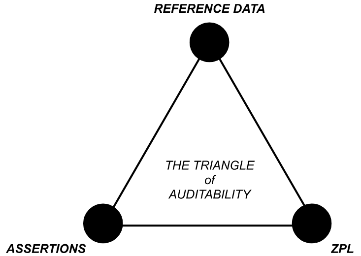

# Introduction

In ZPR, policy delegation is the mechanism that allows a central authority to
safely share control of network access policy with subordinate policy authors
while still enforcing a coherent global security posture. As ZPR deployments
grow in size and organizational complexity, delegation becomes necessary to
distribute policy authoring without fragmenting control or weakening security
guarantees.

In any ZPR deployment of meaningful scale, policy delegation is only one part of
the overall network security environment. In addition to policy, ZPR
incorporates reference data from trusted services, manages a namespace for
services, and enforces authoring permissions for ZPL itself.  Each of these
components has a delegation component which is managed outside of the ZPR
ecosystem but supported by it.  In addition, to ensure a secure environment, all
of these aspects of the network configuration must be auditable.

The "Triangle of Auditability" diagram below illustrates that a complete ZPR
environment involves three separately managed domains.

{height="3in"}

The remainder of this paper focuses specifically on delegation support through
what we call "realms". It describes how delegated policy is constrained,
verified, and enforced, and how reference data from trusted services is used
safely within those constraints.

# Introducing Realms

ZPR uses the concept of a **realm** to describe the unit of delegation of a ZPR
policy.  A realm incorporates:

- The namespace (DNS root) for all services.
- Credentials for accessing reference data through trusted services.
- Restrictions on what is allowed to be expressed in ZPL.
- A policy written in ZPL.

When users access services in ZPRnet they do so using DNS names. The binding of
names to addresses is a function provided by the ZPRnet. Each realm has a DNS
root in which all the defined services can be found.

ZPL always exists in a realm. A simple ZPRnet installation has a single, unnamed
realm; explicit realm naming is only required when you want to use delegation.

Within a realm, policy statements can only reference attributes accessible via
the realm's credentials, and can only affect services defined within the realm's
namespace. For example:

> `Allow interns to access lifecycle:test services`

In the above `services` means "services in this realm".

# Configuring a Realm

To delegate policy a top level ZPR administrator first needs to organize the
service namespace. This step is tightly coupled to service discovery. We use DNS
here but other schemes are possible.  For example, if the root domain is
"corp.com" the administrator may split the namespace into "marketing.corp.com"
and "finance.corp.com" with the intention of delegating those service areas to
separate groups within the organization.  What this means in practice is that
the marketing department is free to define services with names like
`database.marketing.corp.com` or `addserver.marketing.corp.com`, while the
finance department can define services with names like
`database.finance.corp.com`, etc.

Next the administrator needs to decide how each realm will access the reference
data available on the network. Reference data is accessed through _trusted
services_, for example an LDAP service. Access to those services requires
credentials which must be specified for each realm.  Attributes available to a
user with a finance role may be different from those available to a user with a
marketing role.  This is an organizational IT decision not managed by ZPR, but
the support for realm credentials means ZPR adheres to organizational policies.

Finally the administrator can add restrictions to each realm. The restrictions
are written in a subset of ZPL: only `never allow` statements and assertions are
permitted.  As an example, the administrator may include a statement such as:

> `Never allow role:finance services to access internet-gateway services.`

This prevents finance services from ever communicating with the public internet,
regardless of what the realm policy permits.

The key consequence of realm delegation is that when A delegates to B, A defines
the service namespace that falls under B's authority and sets the credentials
with which B's policy will access trusted services. The delegator always retains
the ability to define restrictions for a delegated namespace. A delegatee cannot
set policy for anything outside the namespace defined by its delegator.

Since realms use service namespaces it is best practice to leave the assignment
of addresses to the ZPRnet itself. That way there can be no accidental duplicate
address assignment. However, even if IP addresses are set in the configuration,
duplicate address assignment can be caught by the visa service at policy install
time.

## Realm Tokens and Deployment

Once the realms are configured, tokens are generated that verify the realm
authenticity. For example this could be a cryptographic signature. The purpose
of a token is to tie the realm service namespace (a DNS root) to the realm
credentials, owner and restrictions in a way that the visa service can validate.

Realm administrator identities and tokens are provided to the visa service by
the ZPR administrator. The realm configurations are given to the administrators
of the organizational units (in our example, finance and marketing).

To use the realm, each realm holder writes policy in ZPL that is then compiled,
validated against its realm, and then can be separately loaded into the visa
service which verifies the token before installing the policy.

# Nested Delegation

If the visa service supports it, the realm system is flexible enough to support
nested delegation to arbitrary levels: a delegatee can delegate their namespace
to others.  For example, the realm owner of `marketing.corp.com` can delegate
`it.marketing.corp.com` or any other subdomain as she sees fit.

Restrictions imposed by any ancestor realm are enforced at all levels; a deeply
nested delegatee cannot circumvent a `never allow` rule set by any of its
predecessors.

# Delegation Attributes

Attributes must be carefully controlled in order to keep realm policy from
matching things it should not.  Within a realm, attributes can be controlled
through careful configuration of access credentials and/or through the use of
assertions in the realm restriction.

Recall that in ZPL the only way to bind a service to a providing identity is
through attributes. Attribute names may be system wide so a realm administrator
could theoretically reference attributes outside of their authority unless care
is taken. To prevent the binding of services that lie outside of the
administrative control of the realm owner you must restrict the attributes in
use.

It is perfectly acceptable for the finance administrator to write a ZPL
statement to permit marketing users to access some financial service like this:

> `Allow dept:marketing users to access finance-website-01.`.

But, assuming that all the marketing services have an attribute like
`marketing-service-role`, this should not be allowed in the finance realm:

> `Define fake-service as a service with marketing-service-role:dbserver.`

In the above example the finance admin is trying to gain access to a marketing
database service.  If the finance credential used to access the attribute
service is configured to never return the `marketing-service-role` attribute the
ZPL will never match anything.  With a correctly configured attribute service,
the error could be caught at the compiler when it queries the service using the
finance credential.  Even if the ZPL is not flagged at the compiler stage, and
the attribute service is mis-configured, the visa service will refuse to allow
the binding of two service names onto the same identity so an error will be
raised.

Using a realm specific attribute tied to an access credential as illustrated
above is best practice. However, you can also add assertions to the realm
restriction that would prevent the delegated administrator from making use of
specific attributes:

> `Assert that no service uses the attribute marketing-service-role.`

# Compiler Responsibilities

The policy compiler is the first enforcement point for delegation. Given a realm
and realm configuration, it is responsible for ensuring that the policy only
uses attributes that are allowed for that delegated author.

The compiler determines the set of allowed attributes from the trusted services.
That set may then be further reduced by the realm restrictions. These
constraints are enforced statically at compile time by generating compilation
errors, preventing the creation of a binary policy file. This design prevents a
delegated administrator from accidentally or intentionally authoring policy that
escapes their delegated scope.

# Visa Service Behavior

A crucial invariant is that `never allow` rules are enforced everywhere in the
delegation hierarchy.  When traffic is evaluated, the visa service always denies
if a `never allow` statement matches. Policy is evaluated realm by realm, in ZPL
policy order. In the absence of a `never allow` the first `allow` matches.

In a non delegated environment, a visa service runs a single policy in what can
be thought of as the global realm, and makes decisions based purely on that
policy. In a delegated environment, the visa service runs many realms at once.

To support this, the visa service:

* Confirms the proof of delegation associated with each realm, so malformed or
  forged delegations are rejected.

* Manages access credentials per realm so that services are only instantiated
  when they match the realms they are defined in.

* Enforces a single service per identity at service binding time.

Each realm maintains its own attribute cache for the trusted services it uses.
This keeps attributes in realms isolated from one another and reduces
the impact of configuration mistakes. At the same time, the visa service uses
global credentials when talking to the authentication service because identity
verification is a shared concern, not scoped per realm.

To grant a visa for a specific request, the visa service first identifies the
service by comparing its protocol details (address, protocol, port). If the
service is bound to a realm, the visa service checks for any `never allow`
statements in the realm policy or its restrictions. Then it looks for any
`never allow` statements in all parent policies and restrictions.  If no `never`
statement matches in the delegation chain then the visa service tries to match
the request against the realm `allow` statements. If an `allow` is found a visa
is granted.

# Enforcement Guarantees

Trusted services play a key role in enforcement by strictly controlling
attribute distribution. They must:

* Only return delegated attributes to the actors authorized to receive them.

* Avoid exposing conflicting attribute sets that would place a service under two
  different delegated realms.

It is important to note that the strict binding of services to delegated realms
only works if attributes are correctly managed in the underlying systems.

While assertions give administrators a way to enforce attribute usage within the
ZPR ecosystem, ZPR normally relies on external, trusted services to return
accurate attribute sets and to avoid exposing attributes that would give a realm
administrator influence outside its authorized scope.

When attribute discipline is followed, the delegation model in ZPR achieves
three goals simultaneously:

1. It lets large organizations distribute policy authoring to many admins
   under central control.

2. It keeps the semantics of delegation aligned with the semantics of normal
   access control through the use of access credentials.

3. It provides clear, auditable boundaries for administrative authority.
   Misconfigurations can be detected through verification of delegation tokens,
   compiler checks, and visa service validation -- as long as attribute sources
   and realm restrictions remain consistent.

