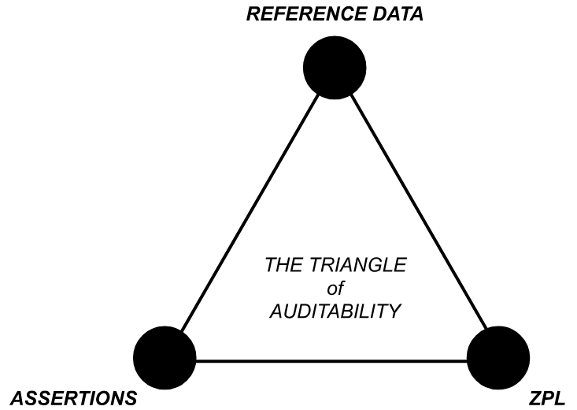

# Introduction

Policy delegation is the mechanism that allows a central authority to
safely share control of network access policy with subordinate policy authors
while still enforcing a coherent global security posture. As ZPR deployments
grow in size and organizational complexity, delegation becomes necessary to
distribute policy authoring without fragmenting control or weakening security
guarantees.

In any ZPR deployment of meaningful scale there will be many delegation
hierarchies, for instance:

- Management of users and groups and their attributes.
- Ability to create and name services.
- Controls around access to data sources like LDAP.
- Issuance of credentials.
- Ability to connect machines and VMs.
- Physical network configuration.
- Management of who can create, edit, read or delete network policy.

These systems support their own delegation mechanisms. For example, Active
Directory (and most databases and applications) manage users, groups, etc. and
who is allowed to create/read/edit/delete (CRED), and who is allowed to bestow
and manage such authority to others.

Authentication and attributes are handled through Trusted Services using
existing third party or in-house systems. The physical substrate and ZPR
configuration are also handled elsewhere using their own tools (and hierarchies)

What remains are services, name spaces, and policies. With ZPL, services are
declared and access to them is controlled. To manage name spaces we tightly
integrate with DNS. Support for delegating policies is built into the Visa
Service using a concept called _domains_.

The remainder of this paper focuses on _domains_, our delegation mechanism in
the Reference Implementation. It describes how delegated policy is constrained,
verified, and enforced, and how reference data from trusted services is used
safely to adhere to existing hierarchical access controls.


## The Problem Space

TODO: background context here...
TODO: whole section needs work.


### Issues that delegation needs to solve (MD)

1. Who can create a service?
2. Where is a service defined?
3. What keeps services from being created/modified/deleted by an unauthorized party?
4. How are services named?
5. What constraints can be enforced for a service within the service namespace?
6. Who can use a service?
7. Who can write "Allow" policies?
8. What is the scope of these policies?
9. What order are the policies evaluated (priority)?
10. Who can write "Never" policies?
11. What is the scope of these policies?
12. Who can read policies?
13. How are the service definitions and access policies audited?


### Other issues that are related to delegation (MD)

1. How are services resolved?
2. How dynamic is the resolution?
3. Can service discovery purposely fail if attributes don't match?
4. Is there a benefit to obfuscating IP addresses to prevent cross-user hacking attempts?


## The Solution (Reference Implementation)

To support policy delegation we added several capabilities to the Reference
Implementation Visa Service:

1. Resolution of service names to addresses is fully under ZPR control. The ZPRnet
   provides DNS for services hosted in ZPR.

This gives the visa service the ability to control not just who can place a
service within a DNS domain, but also who can find it.  The ZPR administrator
can also make use of DNS `cname` records to reorganize the policy delegation
hierarchy in arbitrary ways.


2. A policy management system (PMS) for creating, updating, reading and deleting
   policy tied to domains.

The Visa Service must enforce a collection of policies that are each constrained
to parts of the corporate namespace. As a content management system it enforces
permissioned user access. Interaction with the PMS is through a REST API and
access is controlled by API keys and/or access tokens. The PMS also allows for a
domain to be sub-delegated in a way that maps naturally to how domain names are
used. For example, the domain tied to `marketing.corp.com` could delegate
`accounts.marketing.corp.com` to another administrator.


3. Policy domains use their own credentials to interact with trusted services.

To fit in with access control on existing trusted services (eg, attribute
databases, LDAP, etc) each domain is given credentials that permit it
domain-appropriate trusted service access.


4. Within a domain, policy is subject to restrictions set by whomever configured
   the domain.

When a domain is created, the creator can use a subset of ZPL and assertions to
set restrictions on the kinds of policy rules that can be used in the domain. If
a domain is part of a chain of delegated domains, it is subject to all the
restrictions in the chain.


5. The Visa Service handles compilation of ZPL.

The Visa Service needs to enforce ZPL restrictions that are authored separately
from a domain policy. To make this work the Visa Service is responsible for
actually compiling the domain policy, which it does in the presence of all
applicable restrictions. Only policies that pass compilation can be applied to
the network.


# Policy Domains

ZPR uses the concept of a **domain** to describe the unit of delegation of a ZPR
policy.  A domain incorporates:

1. The namespace (DNS root) for all services.
2. Credentials for accessing reference data through trusted services.
3. Restrictions on what is allowed to be expressed in the domain policy.
4. A policy and configuration written in ZPL.

The first three items in a domain are managed by the domain creator (aka
_delegator_), and we can think of these as comprising the domain "envelope". The
final item, the policy, can be thought of as the "contents" of the "envelope".
The "contents", written in ZPL by the _delegatee_, define services and their
associated policies.

When users access services in ZPRnet they do so using DNS names. Each domain has
a DNS root in which all the defined services can be found and so sets the
services place in DNS. Attributes from trusted services match services to their
providers, and at runtime a request to a service is matched by address, protocol
and port.

ZPL always exists in a domain. A simple ZPRnet installation has a single, unnamed
domain; explicit domain naming is only required when you want to use delegation.

Within a domain, policy statements can only reference attributes accessible via
the domain's credentials, and can only affect services defined within the domain's
namespace. For example:

> `Allow interns to access lifecycle:test services`

In the above `services` means "services in this domain".


# Configuring a domain

To delegate policy a top level ZPR administrator first needs to organize the
service namespace. This step is tightly coupled to service discovery for which
we rely on DNS.  For example, if the root domain is "corp.com" the administrator
may split the namespace into "marketing.corp.com" and "finance.corp.com" with
the intention of delegating those service areas to separate groups within the
organization.  What this means in practice is that the marketing department is
free to define services with names like `database.marketing.corp.com` or
`addserver.marketing.corp.com`, while the finance department can define services
with names like `database.finance.corp.com`, etc.

Next the administrator decides how each domain will access the reference
data available on the network. Reference data is accessed through _trusted
services_, for example an LDAP service. Access to those services requires
credentials which must be specified for each domain.  Attributes available to a
user with a finance role may be different from those available to a user with a
marketing role.  This is an organizational IT decision not managed by ZPR, but
the support for domain credentials means ZPR adheres to organizational policies.

Finally the administrator adds restrictions to each domain. The restrictions
are written in a subset of ZPL: only `never allow` statements and assertions are
permitted.  As an example, the administrator may include a statement such as:

> `Never allow role:finance services to access internet-gateway services.`

This prevents finance services from ever communicating with the public internet,
regardless of what the domain policy permits.

Note that the restrictions on a domain run under the credential of the domain
creator -- not the delegatee.

The key consequence of domain delegation is that the delegator always retains
the ability to define restrictions for a delegated namespace. A delegatee cannot
set policy for anything outside the namespace defined by its delegator.

Since domains use service namespaces it is best practice to leave the assignment
of addresses to the ZPRnet itself. That way there can be no accidental duplicate
address assignment. However, even if IP addresses are set in the configuration,
duplicate address assignment can be caught by the visa service at policy install
time.


(TODO: We do not permit policy to write allow rules about services in other
domains, right? Like in finance domain you can't say 'never allow finance users
to access marketing services'. So if that is desired policy, you need the finance
admin to add a rule. Right?)

(TODO: Probably need to talk a bit about CNAMEs here too.)


# Nested Delegation

The domain system is flexible enough to support nested delegation to arbitrary
levels: a delegatee can further delegate their namespace to others.  For
example, an admin in charge of `marketing.corp.com` can delegate
`it.marketing.corp.com` or any other subdomain as she sees fit.

Restrictions imposed by any ancestor domain are enforced at all levels; a deeply
nested delegatee cannot circumvent a `never allow` restriction set by any of its
predecessors.  Unlike restrictions, the actual domain policy only ever applies
to the domain it is in.


# Delegation Attributes

Attributes must be carefully controlled in order to keep domain policy from
matching things it should not.  Within a domain, attributes can be controlled
through careful configuration of access credentials and/or through the use of
assertions in the domain restriction.

Recall that in ZPL the only way to bind a service to a providing identity is
through attributes. Attribute names may be system wide so a domain administrator
could theoretically reference attributes outside of their authority unless care
is taken. To prevent the binding of services that lie outside of the
administrative control of the domain administrator you must restrict the
attributes in use.

For example, it is perfectly acceptable for the finance administrator to write a
ZPL statement to permit marketing users to access some financial service like
this:

> `Allow dept:marketing users to access finance-website-01.`.

But, assuming that all the marketing services have an attribute like
`marketing-service-role`, this should not be allowed in the finance domain:

> `Define shadow-service as a service with marketing-service-role:dbserver.`
> `Allow dept:finance users to access shadow-service.`

In the above example the finance admin is trying to gain access to a marketing
database service. The namespace controls ensure that the service will be found
under the name `shadow-service.finance.corp.com`, but if the only provider
constraint is based on `marketing-service-role` then the finance ZPR
administrator has essentially created an alias to the marketing database.
However if the finance domain credentials used to access the attribute service
is configured to never return the `marketing-service-role` attribute then the
ZPL will never match anything, and would cause a compilation error.

Using a domain specific attribute tied to an access credential as illustrated
above is best practice. However, you can also add assertions to the domain
restriction that would prevent the delegated administrator from making use of
specific attributes:

> `Assert that no service uses the attribute marketing-service-role.`


# Compiler Responsibilities

The policy compiler is the first enforcement point for delegation. Given a domain
and domain configuration, it is responsible for ensuring that the policy only
uses attributes that are allowed for that delegated author.

The compiler determines the set of allowed attributes from the trusted services.
That set may then be further reduced by the domain restrictions. These
constraints are enforced statically at compile time by generating compilation
errors, preventing the creation of a binary policy file. This design prevents a
delegated administrator from accidentally or intentionally authoring policy that
escapes their delegated scope.

Even though the Visa Service manages compilation, the compiler is still
available as a standalone tool and can be useful for local testing even without
access to the domain restrictions. API calls to the visa service can be used by
policy administrators to "test compile" their domain policy in the fuller
network policy context.


# Visa Service Behavior

In a non delegated environment, a visa service runs a single policy in the
global domain, and makes decisions based purely on that policy. In a delegated
environment, the visa service runs many domains at once.

A crucial invariant is that `never allow` rules and assertions are enforced
everywhere in the delegation hierarchy.  When traffic is evaluated, the visa
service always denies if a `never allow` statement matches. Policy is evaluated
based on the domain holding the service being accessed. In the absence of a
`never allow` the first `allow` statement in the policy matches.

Each domain maintains its own attribute cache for the trusted services it uses.
This keeps attributes in domains isolated from one another and reduces
the impact of configuration mistakes. At the same time, the visa service uses
global credentials when talking to the authentication service because identity
verification is a shared concern, not scoped per domain.

To grant a visa for a specific request, the visa service first identifies the
service by comparing its protocol details (address, protocol, port). If the
service is bound to a domain, the visa service checks for any `never allow`
statements in the domain policy or its restrictions. Then it looks for any
`never allow` statements in all parent policy restrictions.

If no `never` statement matches in the delegation chain then the visa service
tries to match the request against the domain `allow` statements (in the order
as written in ZPL). If an `allow` is found a visa is granted.

(TODO: DOES THIS SEEM RIGHT? ==> the DENY path only looks restrictions on the
domain, and on any parent domain, and then in the domain policy itself. The
ALLOW path only looks at the domain policy itself.)


# Enforcement Guarantees


To summarize how domains work:

- A domain owns service names under its DNS root.
- A domain policy may define and allow access only to services in that domain.
- Ancestor restrictions always constrain descendants.
- Policy rules in a domain only apply to that domain.
- Restrictions compile/evaluate with the delegator’s authority, not the delegatee’s.
- Attribute visibility is determined by domain credentials and may be narrowed by assertions.


Trusted services play a key role in enforcement by strictly controlling
attribute distribution. They must:

* Only return delegated attributes to the entities authorized to receive them.

* Avoid exposing conflicting attribute sets that would place a service under two
  different delegated domains.

It is important to note that the strict binding of services to delegated domains
only works if attributes are correctly managed in the underlying systems.

While assertions give administrators a way to enforce attribute usage within the
ZPR ecosystem, ZPR normally relies on external, trusted services to return
accurate attribute sets and to avoid exposing attributes that would give a domain
administrator influence outside its authorized scope.

When attribute discipline is followed, the delegation model in ZPR achieves
three goals simultaneously:

1. It lets large organizations distribute policy authoring to many admins
   under central control.

2. It keeps the semantics of delegation aligned with the semantics of normal
   access control through the use of access credentials.

3. It provides clear, auditable boundaries for administrative authority.
   Misconfigurations can be detected through policy audits, compiler checks, and
   visa service validation.


# Example

In this example we consider a company with an accounting department and a
marketing department. The company initially deploys ZPR without delegation using
the default domain.  We first show the monolithic single-domain setup, then show
how it decomposes under delegation.

This assumes some familiarity with ZPL and the TOML configuration syntax used in
the reference implementation.


## Starting point: A single policy and configuration

The visa service is configured with the DNS root set to `corp.com` so all the
services in ZPL are found at the root (eg, "aboutus.corp.com").

The ZPL policy looks like this with rules for both accounting and marketing.


```
define aboutus as a service with marketing-service-role:abweb.
define templates as a service with marketing-service-role:templates.
define mktdb as a service with marketing-service-role:db.
define timetrack as a service with accounting-service-role:timedb.
define expenselog as a service with accounting-service-role:expenses.
define audits as a service with accounting-service-role:audit.
define actdb as a service with accounting-service-role:db.


define employee as a user with corp-id:.
define marketing-employee as an employee with dept:marketing.
define fulltimer as an employee with emp-type:fte.
define auditor as an employee with dept:accounting, role:auditor.

allow aboutus to access mktdb.
allow templates to access mktdb.
allow timetrack to access actdb.
allow expenselog to access actdb.
allow audits to access actdb.
allow marketing-employees to access templates.
allow auditors to access audits.
allow employees to access timetrack.
allow fulltimers to access expenselog.
allow employees to access aboutus.
allow internet-gateway endpoints to access aboutus.
```

And the relevant bits of the configuration. Note that by accessing the attribute
service with a "global" credential, it returns the role attributes for both
accounting and marketing.

```toml
[dns]
root = "corp.com"
cnames = [
  "corp.com -> aboutus.corp.com"
]

[trusted_services.okta_auth]
api = "validation"
credential = "global_oktakey.1231299439949"
returns_attributes = [
  "corp-id -> user.corp.id",
  "dept -> user.dept",
  "emp-type -> user.emp-type",
  "role -> user.role"
]
identity_attributes = [ "corp-id" ]

[trusted_services.ldap1]
api = "attributes"
credential = "global_apikey.120301230023002"
returns_attributes = [
  "marketing-service-role -> service.marketing-service-role",
  "accounting-service-role -> service.accounting-service-role",
  "aud -> service.aud",
  "pubgw -> #endpoint.internet-gateway"
]


[protocol.https]
l4protocol = "TCP"
port = 443

[protocol.redis]
l4protocol = "TCP"
port = 6379

[protocol.odb]
l4protocol = "TCP"
port = 1521

[services.aboutus]
protocol = "https"

[services.templates]
protocol = "https"

[services.mktdb]
protocol = "redis"

[services.timetrack]
protocol = "https"

[services.expenselog]
protocol = "https"

[services.audits]
protocol = "https"

[services.actdb]
protocol = "odb"
```

We now decompose this into two delegated domains, one for marketing and one for
accounting.


## Delegation With Visa Service

The visa service supports delegation through administrative mechanisms all
accessed through an API.  It manages a set of domains. The first domains must be
created by the ZPR administrator but delegated administrators can create domains
too if they are permission'd to do so.

Here is the model used by the Visa Service for a **domain**:

```
Domain
 ├── envelope
 │    ├── namespace
 │    ├── restrictions
 │    ├── trusted service bindings
 │    └── delegation metadata
 │
 ├── policy
 │    ├── zpl
 │    ├── configuration
 │    ├── revisions
 │    └── compiled artifacts
 │
 ├── users
 │
 └── audit history
 ```

The visa service manages its own set of administrators along with what domain
they are in and their associated permissions. Domain policies are submitted via
the API in ZPL form and the visa service manages the compilation step, ensuring
that all the delegation restrictions are applied before accepting/installing the
policy.  Finally, the visa service provides auditing capabilities, with the
correct permissions an auditor can access:

- All the active policy on the ZPRnet and its hierarchical ordering.
- All the users who have access to policy and their access level.
- All historical operations performed on policy and the user access system.

To get started, the ZPR administrator configures a base configuration for the
`root` domain that includes trusted service information. Note that the `cnames`
section has been updated since the `aboutus` service is now inside the
`marketing` domain.

```toml
[dns]
root = "corp.com"
cnames = [
  "corp.com -> aboutus.marketing.corp.com"
]

[trusted_services.okta_auth]
api = "validation"
credential = "global_oktakey.1231299439949"
returns_attributes = [
  "corp-id -> user.corp.id",
  "dept -> user.dept",
  "emp-type -> user.emp-type",
  "role -> user.role"
]
identity_attributes = [ "corp-id" ]

[trusted_services.ldap1]
api = "attributes"
credential = "zpr_apikey.1208748778383002"
returns_attributes = [
  "aud -> service.aud",
  "pubgw -> #endpoint.internet-gateway"  # is a tag
]

```


The ZPR administrator creates two domains using the visa service REST API.
Essentially submitting domain data structures.

Here is an example for the "marketing" domain:

```json
{
  "parent_domain":"root",
  "domain":"marketing",
  "validation_services":[
    {
      "service_id": "okta_auth",
      "inherit": ["credential", "attributes"]
    }
  ],
  "attribute_services":[
    {
      "service_id": "ldap1",
      "inherit": []
    },
  ],
  "restrictions":[
    "never allow aud:internal services to access endpoint.internet-gateway services"
  ]
}
```

Since `domain` is set to `marketing` and the `parent_domain` is `root`, the DNS
root domain for this Visa Service "domain" will be `marketing.corp.com`.


It is not shown here, but the JSON for the "accounting" domain follows roughly
the same structure as "marketing" above.

The Visa Service manages user access to domain content by keeping a database of
user records along with their authentication details and domain permissions. The
Visa Service supports a set of roles that can be assigned to users.


- **policy_admin**:
  - Read and write access to all policy in all domains.
  - Read and write access to all domain and user configuration.

- **policy_writer**:
  - Read and write access to policy in all domains.

- **policy_auditor**:
  - Read access to all policy in all domains.
  - Read access to all Visa Service domain and user configuration.

- **policy_reader**:
  - Read access to all policy in all domains.

- **domain_admin**:
  - Read and write access to policy in a domain.
  - Read and write access to user configuration in a domain.
  - Ability to create/edit/delete sub-domains.

- **domain_writer**:
  - Read and write access to policy in a domain.

- **domain_auditor**:
  - Read access to policy in a domain.
  - Read access to user configuration in a domain.

- **domain_reader**:
  - Read access to policy in a domain.


For this example, the ZPR administrator adds the `marketing_editor` and the
`accounting_editor` to the visa service user database, each given write access to
their domain.  Here is the configuration for the `marketing_editor`:

```json
{
   "user_id": "marketing_editor",
   "provider": "vs.zpr",
   "access": [
      { "role": "domain_writer", "domain": "marketing" }
   ],
   "status": "enabled"
}
```

And the `accounting_editor`:

```json
{
   "user_id": "accounting_editor",
   "provider": "vs.zpr",
   "access": [
      { "role": "domain_writer", "domain": "accounting" }
   ],
   "status": "enabled"
}
```

The Visa Service supports external authentication. Obviously this requires that
there is already enough policy present for a authentication service to connect,
but once one is available, a user record can be inserted using it. For example,
here is the `auditor` record which is authenticated by an Okta service.


```json
{
   "user_id": "auditor",
   "provider": "okta",
   "issuer": "https://corp.okta-gw.corp.com",
   "subject": "00u1234567890abcdef",
   "access": [
      { "role": "policy_auditor" },
   ],
   "status": "enabled"
}
```


Each domain editor creates their own ZPL and configuration details and installs
them into the visa service using the API. When the domain policies are
submitted, the visa service performs compilation and incorporates all the
restrictions applied through delegation.

Note that the visa service is not configured with the trusted service
credentials directly -- those are provided to the domain administrators out of
band and submitted with their policy configuration.


### Marketing Policy

The marketing ZPR administrator only needs to write policy about services
managed by the marketing department.

All the services defined in the marketing domain will be found in DNS in the
correct subdomain (which is the domain name, eg, "aboutus.marketing.corp.com")
and no other domain can add or alter names in the marketing namespace.


The marketing ZPL:

```
define aboutus as a service with marketing-service-role:abweb.
define templates as a service with marketing-service-role:templates.
define mktdb as a service with marketing-service-role:db.

define employee as a user with corp-id:.
define marketing-employee as an employee with dept:marketing.

allow aboutus to access mktdb.
allow templates to access mktdb.
allow marketing-employees to access templates.

allow employees to access aboutus.
allow internet-gateway endpoints to access aboutus.
```

And the relevant bits of the marketing configuration is below. Notice that
this uses a marketing specific credential to talk to the "ldap1" attribute
service.

```toml
[trusted_services.okta_auth]
inherit = true

[trusted_services.ldap1]
inherit = true
credential = "marketing_apikey.1208748778383002"

# Replace the inherited mapping with our own.
returns_attributes = [
  "marketing-service-role -> service.marketing-service-role",
  "aud -> service.aud",
  "pubgw -> #endpoint.internet-gateway"
]

[protocol.https]
l4protocol = "TCP"
port = 443

[protocol.redis]
l4protocol = "TCP"
port = 6379

[services.aboutus]
protocol = "https"

[services.templates]
protocol = "https"

[services.mktdb]
protocol = "redis"
```

### Accounting Policy

The accounting ZPL is similarly the accounting-relevant subset of the monolithic policy.


```
define timetrack as a service with accounting-service-role:timedb.
define expenselog as a service with accounting-service-role:expenses.
define audits as a service with accounting-service-role:audit.
define actdb as a service with accounting-service-role:db.


define employee as a user with corp-id:.
define fulltimer as an employee with emp-type:fte.
define auditor as an employee with dept:accounting, role:auditor.

allow timetrack to access actdb.
allow expenselog to access actdb.
allow audits to access actdb.

allow auditors to access audits.
allow employees to access timetrack.
allow fulltimers to access expenselog.
```

And the relevant bits of the accounting configuration are below. Notice that it
uses an accounting specific credential to talk to the "ldap1" attribute service.

```toml
[trusted_services.okta_auth]
inherit = true

[trusted_services.ldap1]
inherit = true
credential = "accounting_apikey.120941238688493002"
returns_attributes = [
  "accounting-service-role -> service.accounting-service-role",
  "aud -> service.aud",
  "pubgw -> #endpoint.internet-gateway"
]


[protocol.https]
l4protocol = "TCP"
port = 443

[protocol.odb]
l4protocol = "TCP"
port = 1521

[services.timetrack]
protocol = "https"

[services.expenselog]
protocol = "https"

[services.audits]
protocol = "https"

[services.actdb]
protocol = "odb"
```


# Visa Service API Outline

(TODO: This does not exist, just a thought experiment for now. Update this as it is built)

| Endpoint                                           | Method   | Primary Data Types                                   | Purpose                                                                                                   |
| -------------------------------------------------- | -------- | ---------------------------------------------------- | --------------------------------------------------------------------------------------------------------- |
| `/v1/domains`                                      | `POST`   | `DomainCreateRequest`, `Domain`                      | Create a delegated domain with namespace ownership, trusted service bindings, and inherited restrictions. |
| `/v1/domains/{domain}`                             | `GET`    | `Domain`                                             | Retrieve domain metadata, delegation chain, restrictions, and trusted service configuration.              |
| `/v1/domains/{domain}`                             | `PATCH`  | `DomainUpdateRequest`, `Domain`                      | Update mutable domain configuration such as restrictions, inheritance behavior, or status.                |
| `/v1/domains/{domain}`                             | `DELETE` | `DeleteResult`                                       | Remove a domain and optionally revoke its delegated authority.                                            |
| `/v1/domains/{domain}/children`                    | `GET`    | `Domain[]`                                           | List delegated subdomains beneath a domain.                                                               |
| `/v1/domains/{domain}/effective-restrictions`      | `GET`    | `RestrictionSet`                                     | Return all inherited and local restrictions enforced for a domain.                                        |
| `/v1/domains/{domain}/services`                    | `GET`    | `ServiceDefinition[]`                                | List services defined within a domain namespace.                                                          |
| `/v1/services/{fqdn}`                              | `GET`    | `ServiceResolution`                                  | Resolve a service name to protocol, address, and owning domain metadata.                                  |
| `/v1/domains/{domain}/policy`                      | `PUT`    | `PolicyUploadRequest`, `PolicyRevision`              | Upload or replace ZPL policy and associated configuration for a domain.                                   |
| `/v1/domains/{domain}/policy`                      | `GET`    | `PolicyDocument`                                     | Retrieve the currently active policy and configuration for a domain.                                      |
| `/v1/domains/{domain}/policy/revisions`            | `GET`    | `PolicyRevision[]`                                   | List historical policy revisions for a domain.                                                            |
| `/v1/domains/{domain}/policy/revisions/{revision}` | `GET`    | `PolicyDocument`                                     | Retrieve a specific historical revision of a policy.                                                      |
| `/v1/domains/{domain}/policy/rollback`             | `POST`   | `RollbackRequest`, `PolicyRevision`                  | Roll back the active policy to a previous revision.                                                       |
| `/v1/domains/{domain}/compile`                     | `POST`   | `CompileRequest`, `CompileResult`                    | Test-compile policy against inherited restrictions and visible attributes without activation.             |
| `/v1/domains/{domain}/install`                     | `POST`   | `InstallRequest`, `InstallResult`                    | Compile, validate, and activate a policy revision atomically.                                             |
| `/v1/domains/{domain}/attributes/visible`          | `GET`    | `AttributeVisibility`                                | Return the attributes visible within the domain based on credentials and assertions.                      |
| `/v1/users`                                        | `POST`   | `UserCreateRequest`, `UserRecord`                    | Create a Visa Service user and assign global or domain-scoped roles.                                      |
| `/v1/users/{user_id}`                              | `GET`    | `UserRecord`                                         | Retrieve a user account, authentication provider details, and assigned roles.                             |
| `/v1/users/{user_id}`                              | `PATCH`  | `UserUpdateRequest`, `UserRecord`                    | Modify user permissions, roles, or account status.                                                        |
| `/v1/domains/{domain}/users`                       | `GET`    | `UserRecord[]`                                       | List users with permissions within a domain.                                                              |
| `/v1/domains/{domain}/audit`                       | `GET`    | `DomainAuditReport`                                  | Return an auditable view of domain policy, restrictions, delegation lineage, and permissions.             |
| `/v1/audit/evaluate`                               | `POST`   | `PolicyEvaluationRequest`, `PolicyEvaluationResult`  | Evaluate whether a source identity may access a destination service under current policy.                 |
| `/v1/audit/trace`                                  | `POST`   | `PolicyTraceRequest`, `PolicyTraceResult`            | Return a detailed rule-by-rule explanation of policy evaluation and restriction matching.                 |


# TODO: ORPHANS - maybe use / maybe throw out


## Triangle

In addition to policy, ZPR incorporates reference data from trusted services,
manages a namespace for services deployed on the network, and enforces authoring
permissions for ZPL itself.  Each of these aspects has a delegation component
which is managed outside of the ZPR ecosystem but supported by it.  In addition,
to ensure a secure environment, all of these aspects of the network
configuration must be auditable.

The "Triangle of Auditability" diagram below illustrates that a complete ZPR
environment involves three separately managed domains.

{height="3in"}


## Delegation Hierarchies (MD)

PR/ZPL relies $only$ on external systems for authentication, access control, and
attributes.

These systems support their own delegation mechanisms. For example,
Active Directory (and most databases and applications) manage users, groups,
etc. and who is allowed to create/read/edit/delete (CRED), and who is allowed to
bestow and manage such authority to others.

To use these existing access controls, ZPL uses authenticated credentials
uniquely associated with each $domain$ to access trusted sources. Visa services
never use their own credentials, but act on behalf of $domains$.

Trusted sources use $domain$ credentials for access control, and tags from
authenticated ZPR connections (composite user, app, machine, etc.) to fetch the
attributes used by policies.

(If ZPR used a superuser to access trusted sources, the onus of enforcing
delegation and access control would fall on the Visa Services. This would be a
huge potential security vulnerability for ZPR)


